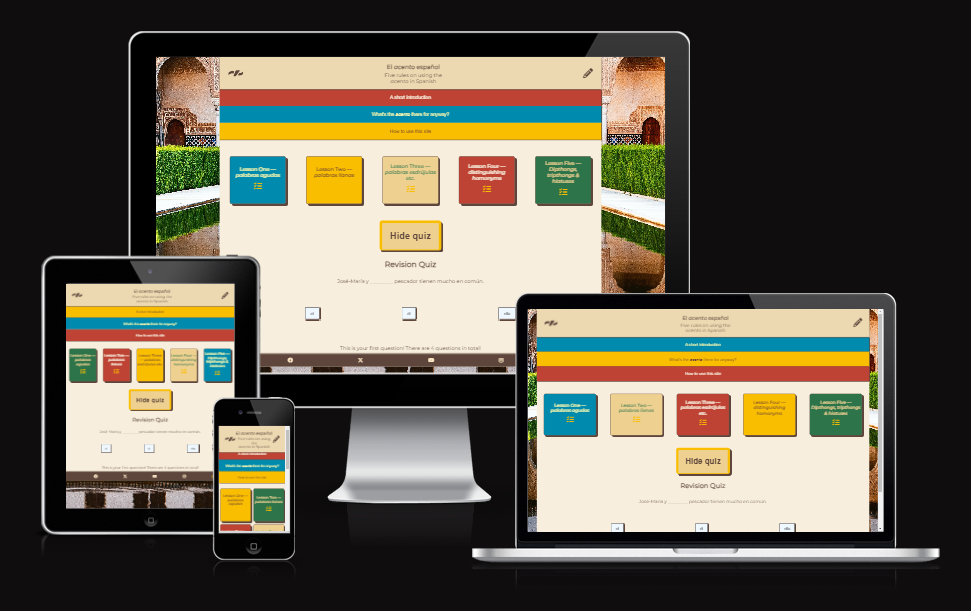
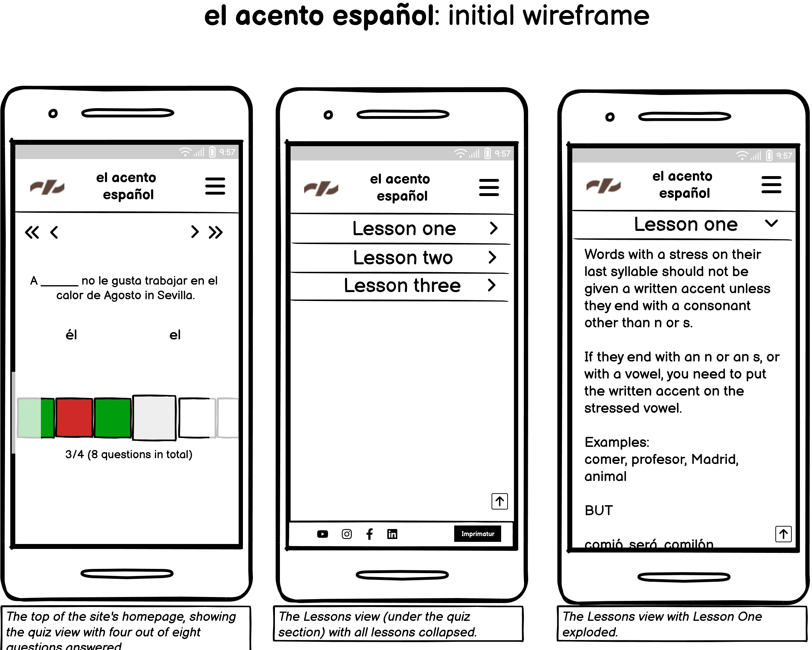

<base target="_blank">

# El acento español - A site to revise the rules on when to write accents in Spanish

## Code Institute - Second Milestone Project: Create an interactive and responsive front-end website according to UX principles with HTML, CSS and JavaScript technologies.

This website was originally developed to showcase my ability to design and create a responsive and interactive website involving the use of simply data structures.

- - -

<!-- TOC start (generated with https://github.com/derlin/bitdowntoc) -->

- [Introduction](#introduction)
- [User experience](#user-experience)
  * [User stories](#user-stories)
- [Structure from the user's point of view](#structure-from-the-users-point-of-view)
  * [Basic initial structure](#basic-initial-structure)
  * [Website pages](#website-pages)
  * [Homepage sections](#homepage-sections)
- [Technical structure (what it looks like under the bonnet)](#technical-structure-what-it-looks-like-under-the-bonnet)
- [Features](#features)
  * [Navigation](#navigation)
  * [Fonts](#fonts)
  * [Colours](#colours)
  * [Responsiveness](#responsiveness)
  * [Favicons](#favicons)
  * [Images](#images)
  * [Icons](#icons)
  * [Other visual details](#other-visual-details)
  * [Video](#video)
  * [Subscription form:](#subscription-form)
  * [Background images](#background-images)
- [Development & implementation environment](#development-implementation-environment)
- [Technologies used](#technologies-used)
- [Deployment](#deployment)
- [Design, development & coding philosophy](#design-development-coding-philosophy)
  * [Wireframe](#wireframe)
  * [Sequence of coding steps](#sequence-of-coding-steps)
  * [Commits](#commits)
  * [Minimising code clutter](#minimising-code-clutter)
  * [Comments in code and order of appearance of css selectors on the style.css file](#comments-in-code-and-order-of-appearance-of-css-selectors-on-the-stylecss-file)
  * [Iterative deployment](#iterative-deployment)
- [Testing](#testing)
  * [Iterative testing, validation and troubleshooting -- during ongoing development](#iterative-testing-validation-and-troubleshooting-during-ongoing-development)
  * [Final testing and validation before submission](#final-testing-and-validation-before-submission)
  * [Final validation](#final-validation)
- [Lessons learnt](#lessons-learnt)
  * [Mobile first](#mobile-first)
  * [One-person agile programming](#one-person-agile-programming)
  * [Time management](#time-management)
- [Lessons not (yet) learned](#lessons-not-yet-learned)
- [What doesn't work](#what-doesnt-work)
  * [... because it's outside the scope of project](#-because-its-outside-the-scope-of-project)
  * [... for lack of time, skill and/or data](#-for-lack-of-time-skill-andor-data)
- [Credits and sources](#credits-and-sources)
  * [Code institute's own resources](#code-institutes-own-resources)
  * [External technical and learning resources](#external-technical-and-learning-resources)
  * [Images and video](#images-and-video)
  * [Personal thanks](#personal-thanks)

<!-- TOC end -->

- - -

<!-- TOC -->
## Introduction
This website was prepared for presentation as my second portfolio project for my online course on web design using HTML, CSS and JavaScript technologies. This includes a requirement to ensure that the website functions correctly and looks professional and complete, but as my course is not in creative web design, I have spent less time and effort on finer aesthetic questions. As the project will be judged according to the criteria set out in the relevant assessment guide contained in the Code Institute LMS, I have tried to be guided by that document.

**A live demo of the website, as deployed within github's hosting environment, can be found [here](https://jaimehyland.github.io/elAcentoEspanyol/)**

- - -

<!-- TOC -->
## User experience
_El acento español_ is a website with a very specific aim: it is there to help English-speaking **elementary and intermediate learners of Spanish as a foreign language** to learn and/or revise the rules on when to use the written Spanish accent (**´**). From the point of view of the fictional **site owner** (a German-based language school called _Acentos_), the site is aimed at publicising the school's existence and at inspiring confidence among users in the school's linguistic and didactic skills and capacities.

<!-- TOC -->
### User stories
As a user, I want to:
- recognise at a glance what the website offers;
- feel a positive emotional pull to the site and the topic it's dealing with;
- move around the site instinctively;
- find the information I need quickly and easily;
- encounter the information I need without having to grapple with overcomplicated language;
- find other sources of information on the specific topic being dealt with;
- contact the site owner by e-mail.

As the site owner, I will expect to:
- see an attractive and useful website that reflects well on me as a professional in language learning;
- have a website that can be easily extended and/or enhanced to help my students and potential students with other issues in their language learning;
- have a website that conforms to German law requiring the website owner (me) to identify myself appropriately, and to provide contact information for the person responsible for the upkeep and security of the site and the data it contains.
- include links to the various accounts of my language school on social media.

### A note on the language used
The target users of this website will all be competent users of Spanish and will be on this site to help them in their language learning process. However, many will not be very advanced learners. The language of the site would therefore ordinarily be what's often referred to as simplified Spanish. The only reason it is in English is to **facilitate the site's assessors**. I'd therefore like the assessors to take into account that the whole site will be rendered in simplified Spanish as soon as feasible after assessment has been completed.
- - -

<!-- TOC -->
## Structure from the user's point of view
<!-- TOC -->
### Basic initial structure
The site has a very simple structure: It consists of a header, presenting the site to the user, along with a battery of specialist lessons and a final section in which users can test their knowledge of the relevant topic.  It also has a simple footer fixed to the bottom of the homepage, containing links as described below.

<!-- TOC -->
### A single webpage
Both sections of the site are contained within a single webpage, with a very simple additional **_Imprimatur:_** page, accessible only via a link on the footer. This page does no more than provide the contact information for the person responsible for the upkeep and security of the site, as required by German Law.

<!-- TOC -->
### Homepage sections
The webpage contains four sections:
1. **_Header:_** The header simply displays the name of the site and its logo. Given the simplicity of the site, the only navigation function it requires is an anchor link to the Quiz section of the homepage.
2. **_Lessons:_** This section contains some simple written lessons on when and how to use the Spanish accent in writing. It contains five simple lessons.
3. **_Quiz_** The Quiz section gives users the opportunity to test their knowledge of the topic covered by the site.
3. **_Footer:_** Contains links to the site-owner's (fictional) social media accounts, as well as to the **Imprimatur** page. 

- - -

<!-- TOC -->
## Technical structure (what it looks like under the bonnet)
This simple website contains just two html files: the homepage and the imprimatur page. Both of these are located in the root directory.
All site assets are contained within the assets sub-directory in the root directory. This assets directory contains in turn four subdirectories:
- assets/css &ndash; contains all the necessary css styling in the assets/css/styles.css file
- assets/favicon &ndash; contains a variety of favicon files and metadata on them for use on a variety of devices, browsers and operating systems
- assets/images &ndash; at present, this directory contains only a single image; the site icon that appears on the header of the homepage
- assets/js &ndash; this directory contains all the JavaScript code required by the site
In addition to all the above, the root directory also contains a quiz.json file, which stores all the data required to create the quiz for the user.

- - -

<!-- TOC -->
## Features
I have implemented a variety of features, among them the following:

<!-- TOC -->
### Navigation
The website has appropriate and clear navigation features. Since it only really consists of a single page, the navigation features no more complicated than they need to be.
- A clearly marked button in the header taking the user straight to the Quiz section.
- The site menu indicates to users which page they are currently on by underlining the appropriate text entry.
- a sticky **go-to-top button** at bottom-right of the viewport, which returns the user to the top of the homepage. It only appears when the user has scrolled a little down the page.

<!-- TOC -->
### Fonts
I have implemented a combination of two clean san-serif fonts suitable for the Spanish theme (with [Nunito sans](https://fonts.google.com/specimen/Nunito+Sans) being the default and selected elements being rendered in [Lato](https://fonts.google.com/specimen/Lato)) to reflect the futuristic vision expressed by the site.

<!-- TOC -->
### Colours
Colours are in appropriate warm terra-cotta and earthy colours appropriate to the Spanish theme and to **accessibility guidelines**.

### Shapes and shadows
The shadows are strong and sharp, reflecting Spanish sunshine, and the buttons are inspired by the form and colours of traditional Spanish windows.

<!-- TOC -->
### Responsiveness
- The website is fully responsive over all tested screen on both portrait and landscape orientations, where applicable (see [Testing](testing) section below).

<!-- TOC -->
### Favicons
Appropriate favicon images were created on the basis of the site logo (see [Images](images) below), using Inkscape to create a 920 x 920px png file and converting it using [favicon.io/favicon-converter](https://favicon.io/favicon-converter/)). The favicon design was created on the basis of the logo (see [Images](images) below). 
<!-- TOC -->
### Images
- The file contains only a single image: a logo based on a stylised Spanish acento appearing over a Spanish ñ tilde to reflect the topic being dealt with on the site. It reflects the site colour scheme and subject matter. The design was made using a vector image and then converted to png format once visual design was complete.

<!-- TOC -->
### Icons
- Here and there around the site the user may occasionally see appropriate icons taken from [fontawesome.com](https://fontawesome.com/). They were all chosen from Fontawesome's free range.

<!-- TOC -->
### Other visual details
- A certain degree of three-dimensionality is provided by subtle box shadows under the header and above the footer.
- The _Imprimatur_ page is considered a "housekeeping" page, and has therefore not been heavily styled.

<!-- TOC -->
### Contact form:
-  A simple _Contact_ form has been implemented to allow users to send their e-mail address to the site owner.

<!-- TOC -->

- - -

<!-- TOC -->
## Development & implementation environment
All the code created during this project was written using gitpod.io, with version control using git.

- - -

<!-- TOC -->
## Technologies used
Exclusively HTML, CSS and JavaScript.
All utilities used as tools to help in creating the site efficiently are mentioned in the relevant sections.

---

<!-- TOC -->
## Deployment
The steps for deploying the website to its github host pages are as follows:
- Choose the Settings icon in the right Github repository.
- Under the list headed 'General', find the 'Pages' item from the 'Code and automation' menu.
- Select 'Deploy from a branch' from the drop-down list labelled 'Source'.
- Select 'main' as your branch, select 'main' from the drop-down list and Save.
- The URL of your site will appear in a box near the top of the page.
- Click on the URL or on the 'Visit site' icon to open your newly deployed site in a new tab.
- The site will then update automatically every time you push a new commit to the master branch.

- - -

<!-- TOC -->
## Design, development & coding philosophy
<!-- TOC -->
### Wireframe

The design process began by creating a low-resolution wireframe using [Balsamiq](https://balsamiq.com/). Since the programming paradigm (see [Sequence of coding steps](sequence-of-coding-steps) below) was "mobile-first", and since the website consists effectively of a solitary  homepage, a single wireframe was made for each of the sections of the main page based on a no-name mobile phone screen. During the course of development, significant deviations were made to the visual layout for mobile devices. Significant changes for responsiveness to various viewport resolutions, based on learning experiences during work on the project and advice and guidance from my mentor, etc..

The original wireframe design (with the accompanying rough notes) can be found [here](documentation/Robotics-Agriculture-Wireframe.pdf)(in pdf format). 

<!-- TOC -->
### Sequence of coding steps
The code was initially written on a section-by-section according to "mobile-first" principle, only building screen-query-based responsiveness into the product once the broad lines of the app were built and tested on the Galaxy-S8 emulator provided by Google. I then adapted the presentation significantly using media queries, among other styling measures.

<!-- TOC -->
### Commits
I committed new changes (between once and two or three times a day), and tried to keep a certain thematic logic to the changes included in each commit, noting down the changes I wished to make in each programming iteration, a little like one might do for a one-person version of the _agile-programming_ methodology. However, I did make some minor changes "on the fly" as I encountered them, sometimes not mentioning them at all in commit comments. I tried to make sure such undocumented changes and bug fixes were limited to minor adjustments. I made extensive use of the ``git diff HEAD`` command to double check what I had actually achieved since the previous commit.

<!-- TOC -->
### Minimising code clutter
I have tried to follow a "clean programming" paradigm in my work. I have therefore:
- not added code for any as-yet unimplemented functionalities (whether commented out or simply never called).
- deleted rather than commented out redundant lines of code.
- avoided repetition as much as possible.
- kept inline comments on code as terse as feasible.
- kept cutting and pasting code to a minimum.

### Considering future changes
While the subject matter of the quiz (whether to add or not to add a written accent mark) meant that the logic of the code used to create the quiz required only two options.  I deliberately designed the code to accept any number of answer options from the json file.

<!-- TOC -->
### Comments in code and order of appearance of css selectors on the style.css file
I have tried to keep comments in my code as terse as possible. I have kept all styling selectors in my _style.css_ file. I have tried to organise my style file starting with generally applicable selectors and moving down to more particular ones, and from homepage to each child page in turn (in order of their appearance on the main site menu), and within pages from what appears on the user screen from left to right and from top to bottom. Selectors are separated by one blank line, while thematic groups of selectors are separated by two.

<!-- TOC -->
### Iterative deployment
Committed code was deployed via github (using the ``git push`` command) on a daily basis at least.

<!-- TOC -->
## Testing
<!-- TOC -->
### Iterative testing, validation and troubleshooting -- during ongoing development
- The main browser against which my code was smoke-tested in an iterative process in the development environment (running a **smoke test** on before every commit at the very least) was the latest version of Google Chrome. 
- Towards the end of the development process, I then began to smoke-check each affected page on the deployed site after every major deployment on all the following machines with increasing frequency: 
- Samsung Galaxy A8 (360 x 740px effective size, running on the latest version of Chrome)
- ipod (768px x 1024px viewport size, running on the latest version of Safari)
- HP laptop (1920 x 1080px) and Dell second screen (1920 x 1200px) both running on latest versions of Chrome, Microsoft Edge and Firefox 

Owing to lack of time, I was unable to do any testing on any legacy versions of these or on any other browsers or machines, with the exception of an informal test on an iphone (version unknown) in dark mode using Safari.
I ran the html code on each page through the officila 

<!-- TOC -->
### Final testing and validation before submission
- All unused files (scratch files, etc.) were carefully removed from the site's root directory and all child directories.
- All internal and external links were smoke-checked systematically before submitting the project for assessment.
- A systematic test on each of the machines and at each of the effective resolutions listed above (in portrait and landscape mode where appropriate) for:
-- Obvious visual issues in relation to accessibility, responsiveness and functionality.
-- The correct functioning of the above-listed functions.
-- The relevant _Code Institute_ assessment criteria for pass, merit and distinction (where not already covered in tests already completed).
- A final smoke-test after deployment running the above tests on each of the above-described devices and resolutions.
- All html pages and the css page were validated (see below).

<!-- TOC -->
### Final validation

I validated my html and css code regularly during development via direct input into the validation services provided by W3C at [validator.w3.org](https://validator.w3.org/) and [jigsaw.w3.org](https://jigsaw.w3.org/css-validator/). My final code passes both validation tests.

- - -
<!-- TOC -->
## Lessons learnt
<!-- TOC --> 

<!-- TOC -->
### Time management
When faced with the inevitable coding challenges of a beginner coder, I could sometimes have managed my time a little better. I often spent too long on bugs without looking for help. In addition, some of my decisions on pages and features to be included were over-ambitious.

- - -

<!-- TOC -->
## Lessons not (yet) learned
One issue I haven't had yet time to research is the implications of differing user interactions on touchscreens as opposed to desktop and laptop screens. As a result, some of the icons do not respond to user interaction in as elegant a manner as I would have hoped on starting out on this little adventure. This is a deficit I need to remedy using javascript or similar.

- - -

<!-- TOC -->
## What doesn't work
<!-- TOC -->
### ... because it's outside the scope of project
Some functionality is incomplete in the project, especially the following:
- Social media links are to the homepages of the respective media.
- No account exists for the e-mail link that appears on the imprimatur page.
- All addresses are fictional.
- Form data entered via the site is sent to code institute's test environment rather than being collected and saved.
 - The 'required' functionality for the postal address section of the subscription page has not been implemented because there appears to be no easy way to remove the required attribute from hidden data input fields using purely html and css.
- The traditional splashscreen to conform with EU GPDR regulations is unnecessary, as no data is being collected in reality.
- Various other functionalities requiring javascript have not been implemented as the site is designed to use effectively exclusively html and css technologies, for example, the menus should really disappear when the user selects an item on them or taps/clicks anywhere else on the screen (as this is done most effectively using javascript, I have postponed implementing this and similar functionalities until I have learnt a little javascript).

<!-- TOC -->
### ... for lack of time, skill and/or data
Pressure of time and my current ignorance of the finer points of aesthetic web design has meant that:
- I haven't been able to use a complex range of tints, much less adopt and implement a fully-fledged colour palette.
- I would like to have implemented one or two more features based on css-only modal dialogs, especially in the 'Breakthroughs' section of the main page.
- I would have liked to implement interactivity with the _events_, providing the user with routing information for upcoming events on selection, and perhaps showing the user images of events in the past.
- I originally intended to hide the top-left anchor link on the homepage for larger screen sizes, and instead to recode the <ins>Home</ins> link on the menu to make it show the anchor menu there instead. That change too will have to wait.
- I would have liked to make the three icons used in the anchor menu link responsive to various screen sizes, growing as the viewport gets bigger.
- The gallery displays images in the order in which I inserted them. In future, they should display in random order. As development continues, they will become more responsive to user interaction
- Two pages that I originally hoped to include in my project (i.e. "The Present" and "The Future" pages) have disappeared from my project for reasons of time. 
- Some individual pictures have appeared in several places on the site (though never on the same page ... I hope!!). Some of the pictures used as background images appear once more in the gallery. I would rarely allow that on a real-life website.
- I should really acknowledge the makers and posters of the many images I downloaded from the internet for the site. This is a high priority for the future.
- More time would have allowed me to make this README.md file a lot _shorter_.

- - -

<!-- TOC -->
## Credits and sources
<!-- TOC -->
### Code institute's own resources
Almost all the code is my own, though much of it either follows closely or takes direct lessons from the code created by Jo Heyndels for the 'Love Running' walkthrough project and/or Anne Greaves' 'Coders Coffeehouse' site. Many thanks are due to both Jo and Anne for their beautiful static websites, their clear instructions and high-quality learning material. I have included an appropriate comment beside the one or two snippets of code directly copied from Jo's walkthrough project. Implicit thanks go to everyone involved in authoring the Code Institute learning materials for this part of the course.

<!-- TOC -->
### External technical and learning resources
Naturally enough, have researched widely to find out how to implement a variety of features not explicitly included in Code Institute's learning materials, including several visits to the following sites:
- [w3schools.com](https://w3schools.com/)
- [stackoverflow.com](https://stackoverflow.com/)
- [freecodecamp.org](https://www.freecodecamp.org/)
- [bestcolleges.com](https://www.bestcolleges.com/)
- [css-tricks.com](https://css-tricks.com/)
- [developer.mozilla.org](https://developer.mozilla.org/)
- [codecademy.com](https://www.codecademy.com/)
- [w3docs.com](https://www.w3docs.com/)
- [geeksforgeeks.org](https://www.geeksforgeeks.org/)

However, the only external source from which I directly copied was freecodecamp.org, from whom I more or less directly copied the [back-to-top button functionality](https://www.freecodecamp.org/news/css-only-back-to-top-button/).

I used some code I found at [https://github.com/derlin/](https://derlin.github.io/bitdowntoc/) to generate this readme file's table of contents. In addition, I took advantage of [markdowntohtml.com](https://markdowntohtml.com/) for some of the work on the Explore page.

<!-- TOC -->
### Images
All images were my own, developed using inkscape.

<!-- TOC -->
### Personal thanks
Apart from Jo and Anne and the authors of the various online resources I (because they were all made by humans!), I owe special thanks to the following people:
- My mentor, Oluwafemi Medale, for being available every time I needed him, and for providing high-quality, relevant and timely advice;
- David Calikes of Code Institute's student welfare service, who provided encouragement when it mattered and who gave more than a few practical tips in the run up to submission deadline, and who generally acted as a supplementary mentor;
- Code Institute's excellent tutoring team, whose help I probably didn't lean on as much as I should have;
- The images I used were too many for me to provide individual acknowledgements to each provider within the time available to me. Thanks to everyone involved in making and posting them!
- My family, for putting up with my absences, frequent cries of anguish and occasional roars of triumph.
